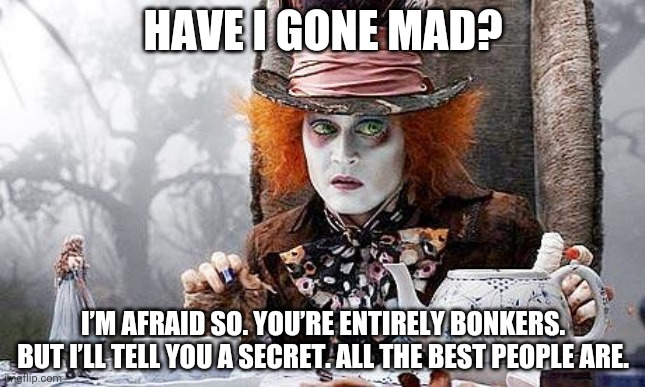

A mother, a PM a covid survivor, a wannabe stand up,forever student .. There are so many hats people wear, eventually we are all some kind of Mad Hatter trying to live our lives to the best of our ability.

### But let's get to the details :
On the professional front I am a Tech MBA student at Cornell Tech university living like a New Yorker ( I think I dreamed FRIENDS into life for me). I was a PM in the before life and hopefully will continue to be a stronger and better PM in the after. I love problem solving and putting things together to come up with a solution. As an Indian, I have done more sudoku, scrambled words, crossword puzzles, picture puzzles which are closed loop puzzles. What I am trying to learn at Cornell Tech and every day at work is designing solutions in the face of ambiguity. Can a problem be even solved? Apart from PM I love Data Analytics and have worked quite a few years designing models and deriving insights in the Ad Tech business. 

In my personal life, I am wife to my husband for 10 years and partner for 15. We have two amazing boys aged 8 and 2.5. When I decided to take up the opportunity to pursue my MBA at Cornell Tech because I have forever wanted to have an MBA and also to start my life afresh after a very life changing COVID infection, my beautiful family supported me by moving across the ocean and settling in Seattle.

I love reading, travelling, watching FRIENDS and cracking PJs with my friends. I am considering exploring the world of gaming but let's see how that goes. On a day to day basis, I battle between my introvertness and extrovertedness and haven't had a clear winner yet.

### Contact me

[vbp23@cornell.edu](mailto:vbp23@cornell.edu)
